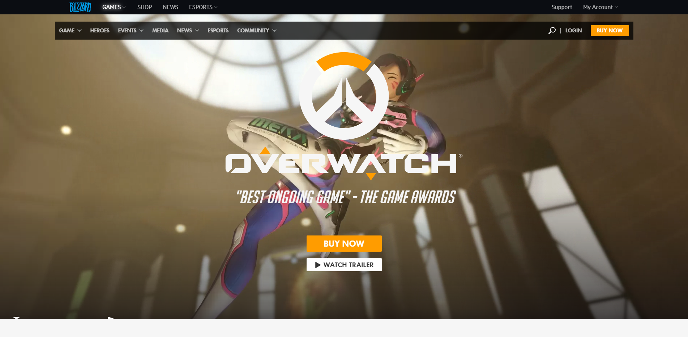
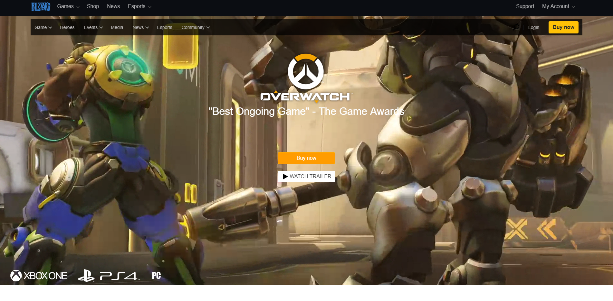
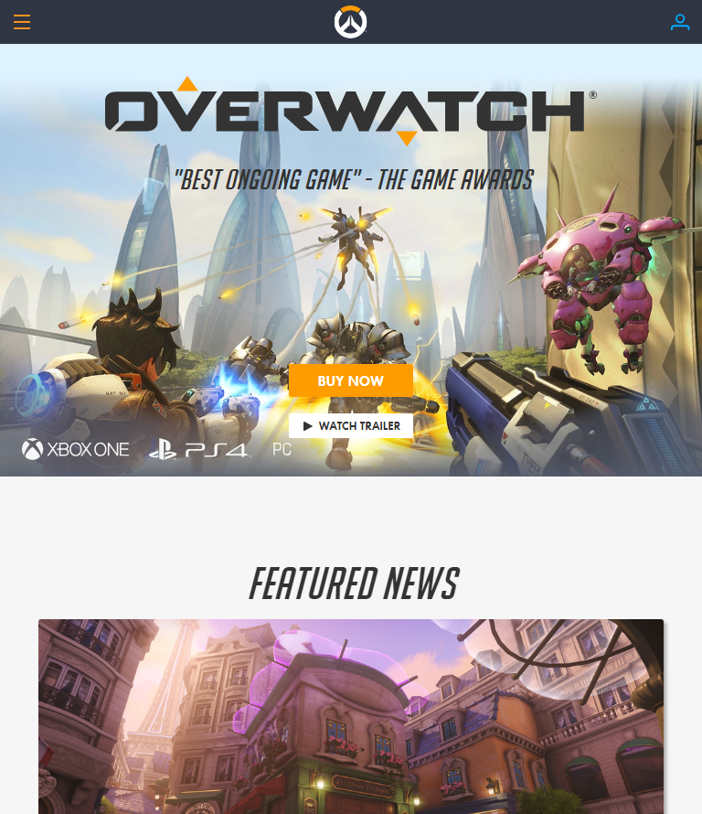
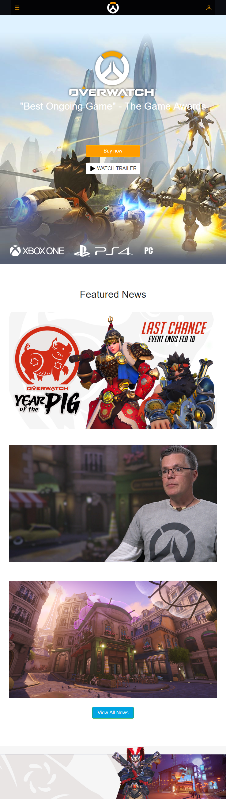

# Overwatch Site Clone

#### By _**{Ward Chamberlain}**_

## Description

_Overwatch Clone website to practice CSS flexbox, Positioning, and Media Queries._

## Setup/Installation Requirements

* _Download or Clone from Git Repository at https://github.com/wchamberlain89/ui-week-one.git_
* _Open index.html in text editor of your choice to view code or open in browser of your choice to view website_

## Known Bugs

buy now text on button deforms when small mobile size

## Support and contact details

wchamberlain89@gmail.com to contact Ward Chamberlain

## Technologies Used

* Flexbox
* SASS

### License

Copyright (c) 2016 **_{ward chamberlain}_**

